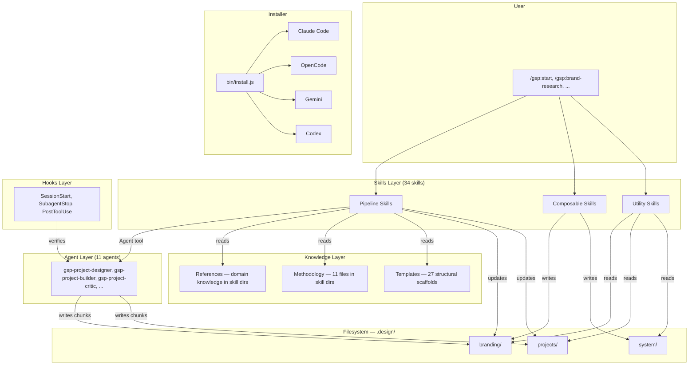
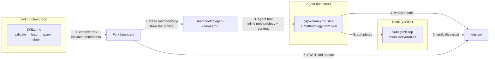
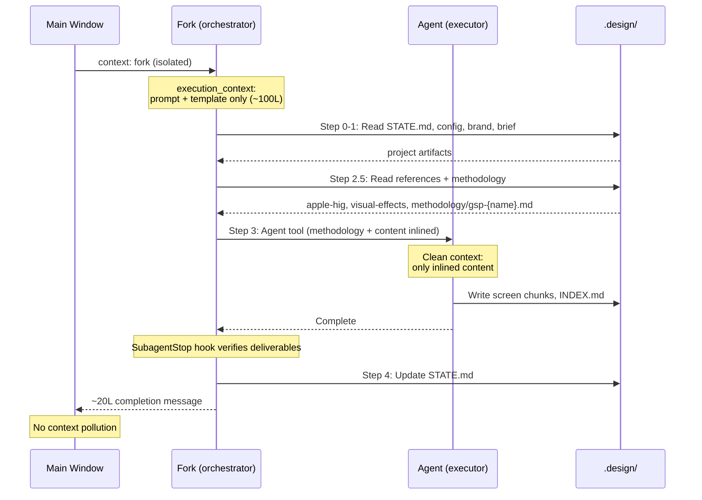
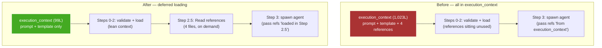
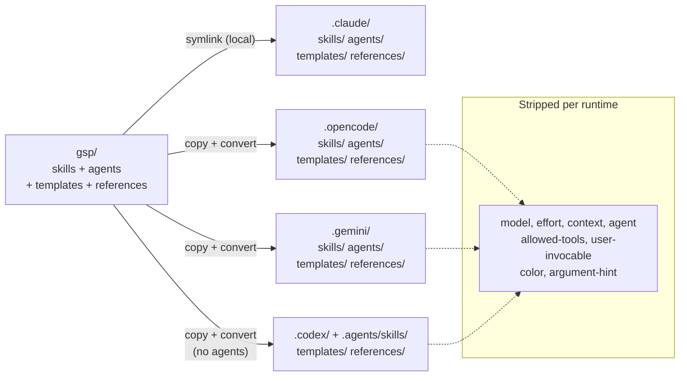

# GSP Architecture & Glossary

## System overview



## Dual-diamond pipeline

```mermaid
graph LR
    subgraph "Diamond 1 — Branding"
        BA["0. Audit<br/><sub>gsp-brand-audit</sub>"]
        BR["1. Research<br/><sub>gsp-brand-research</sub>"]
        BS["2. Strategy<br/><sub>gsp-brand-strategy</sub>"]
        BI["3. Identity<br/><sub>gsp-brand-identity</sub>"]
        BP["4. Patterns<br/><sub>gsp-brand-patterns</sub>"]
        BA -.->|optional| BR
        BR --> BS --> BI --> BP
    end

    subgraph "Diamond 2 — Project"
        PBR["1. Brief<br/><sub>gsp-project-brief</sub>"]
        PRE["2. Research<br/><sub>gsp-project-research</sub>"]
        PDE["3. Design<br/><sub>gsp-project-design</sub>"]
        PCR["4. Critique<br/><sub>gsp-project-critique</sub>"]
        PBU["5. Build<br/><sub>gsp-project-build</sub>"]
        PRV["6. Review<br/><sub>gsp-project-review</sub>"]
        PBR --> PRE --> PDE --> PCR --> PBU --> PRV
        PCR -.->|"needs-revision"| PDE
        PRV -.->|"needs-revision"| PBU
    end

    BP -->|"brand.ref"| PBR
```



## Skill → Agent → Hook wiring



### Wiring table

| Skill | Agent(s) | SubagentStop hook | Forked |
|-------|----------|-------------------|--------|
| `project-design` | `gsp-project-designer` | screen chunks + INDEX.md + preview.html | yes |
| `project-critique` | `gsp-project-critic` + `gsp-accessibility-auditor` | critique.md + prioritized-fixes.md + strengths.md | yes |
| `project-build` | `gsp-project-builder` (N times) | BUILD-LOG.md + INDEX.md + no TODOs | no |
| `project-review` | `gsp-project-reviewer` | acceptance-report.md + issues.md + INDEX.md + verdict | yes |
| `brand-research` | `gsp-brand-researcher` | -- | no |
| `brand-strategy` | `gsp-brand-strategist` | -- | no |
| `brand-identity` | `gsp-brand-creative-director` | -- | no |
| `brand-guidelines` | `gsp-brand-engineer` | -- | no |
| `brand-audit` | `gsp-brand-auditor` | -- | no |
| `brand-sync` | -- (inlined) | -- | no |
| `project-brief` | -- (inlined) | -- | no |
| `project-research` | `gsp-project-researcher` | -- | no |
| `accessibility-audit` | `gsp-accessibility-auditor` | -- | no |
| `art` / `pretty` | -- (inlined) | -- | no |

## Context flow in a forked skill



## Model guidance

Model selection is the user's choice — skills do not enforce a specific model. Pipeline creative/technical skills include a hint in their `description:` field as passive guidance.

**Recommendations** (not enforced):
- **Creative/technical phases** (design, critique, build, strategy, identity, guidelines) — benefit from the most capable model available
- **Research/utility phases** (research, scaffold, doctor, start, help) — work well with faster/cheaper models
- **Expertise skills** (color, typography, accessibility, style) — work well with any model

## Execution context optimization



### Agent methodology extraction

Agent `.md` files are thin stubs (~12 lines): frontmatter (tools, hooks) + one-line body. Full methodology lives in the spawning skill's `methodology/` directory:

```
gsp/skills/gsp-project-design/
├── SKILL.md                              ← orchestrator
├── methodology/
│   └── gsp-project-designer.md            ← agent methodology (loaded at spawn)
├── apple-hig-patterns.md                 ← domain reference
└── ...

gsp/agents/gsp-project-designer.md       ← stub: tools + permissions only
```

**Flow:** Skill reads `methodology/gsp-{agent}.md` → inlines into Agent tool prompt → agent gets clean context with full methodology.

**Session-start cost:** 11 agent stubs = ~130 lines (was 1,536 lines with full definitions). Methodology loads on-demand when the skill spawns the agent.

**Shared agents:** Secondary consumers read methodology via cross-skill path: `${CLAUDE_SKILL_DIR}/../gsp-{primary-skill}/methodology/gsp-{agent}.md`

**Inlined agents (no stub):** 3 agents were eliminated — their work folded directly into the skill: `project-brief` (was scoper), `brand-sync` (was syncer), `art`/`pretty` (was ascii-artist).

### Context savings per skill

| Skill | Before | After | Saved |
|-------|--------|-------|-------|
| `project-design` | 6 includes (1,023L) | 2 includes (99L) | **-924L** |
| `project-critique` | 8 includes (871L) | 3 includes (105L) | **-766L** |
| `project-build` | 5 includes (909L) | 2 includes (126L) | **-783L** |
| `gsp-start` | 10 includes (561L) | 1 include (87L) | **-474L** |
| **Total (skills)** | **3,364L** | **417L** | **-2,947L** |
| `agents (session start)` | 1,536L | 130L | **-1,406L** |

## `.design/` filesystem structure

```mermaid
graph TD
    D[".design/"]
    D --> BR["branding/{brand}/"]
    D --> PJ["projects/{project}/"]
    D --> SY["system/"]
    D --> CL["CHANGELOG.md"]

    BR --> BA["audit/"]
    BR --> BD["discover/"]
    BR --> BST["strategy/"]
    BR --> BID["identity/"]
    BR --> BPA["patterns/<br/>tokens.json + INDEX.md"]
    BR --> BBR["BRIEF.md"]
    BR --> BSS["STATE.md"]
    BR --> BCF["config.json"]

    PJ --> PBR["brief/"]
    PJ --> PRE["research/"]
    PJ --> PDE["design/<br/>screen-NN-name.md + shared/ + preview.html"]
    PJ --> PCR["critique/"]
    PJ --> PBU["build/<br/>BUILD-LOG.md + SCAFFOLD-LOG.md"]
    PJ --> PRV["review/"]
    PJ --> PCB["codebase/<br/>MANIFEST.md"]
    PJ --> PEX["exports/<br/>INDEX.md"]
    PJ --> PRF["references/"]
    PJ --> PBF["brand.ref"]

    SY --> SST["STACK.md"]
    SY --> SCO["COMPONENTS.md"]
    SY --> STO["TOKENS.md"]
    SY --> SCN["CONVENTIONS.md"]
```



## Multi-runtime installer



## Skill anatomy

Every skill directory follows one of four profiles depending on how much domain knowledge it owns and whether it spawns an agent.

### Profile 1 — Thin router (no siblings)

Owns no domain knowledge. Logic is fully self-contained in `SKILL.md`. Detects context, routes to another skill or prints output inline.

```
gsp-start/
└── SKILL.md
```

Examples: `gsp-start`, `gsp-doctor`, `gsp-progress`, `gsp-help`, `gsp-phase-transition`, `gsp-add-reference`, `gsp-update`, `gsp-pretty`, `gsp-design-system`, `gsp-brand-refine`, `gsp-project-brief`, `gsp-brand-brief`

### Profile 2 — Inline skill with references (no agent)

Runs deterministically inline. Has sibling files the skill reads on demand — rules, theming guides, technique specs.

```
gsp-scaffold/
├── SKILL.md
├── shadcn-rules.md
└── shadcn-theming.md
```

Examples: `gsp-scaffold`, `gsp-art`, `gsp-brand-sync`

### Profile 3 — Pipeline skill with methodology (spawns one agent)

Orchestrates one agent. Methodology lives as a sibling file — never inside the agent stub. May also have reference files the skill passes to the agent.

```
gsp-project-research/
├── SKILL.md
└── methodology/
    └── gsp-project-researcher.md
```

```
gsp-brand-strategy/
├── SKILL.md
├── brand-archetypes.md        ← reference passed to agent
├── brand-prism.md
├── positioning-frameworks.md
├── voice-tone.md
└── methodology/
    └── gsp-brand-strategist.md
```

Examples: `gsp-brand-research`, `gsp-brand-strategy`, `gsp-brand-identity`, `gsp-brand-guidelines`, `gsp-brand-audit`, `gsp-project-research`, `gsp-project-design`, `gsp-project-critique`, `gsp-project-review`, `gsp-accessibility-audit`

### Profile 4 — Expertise skill (domains/ + references/)

Owns a knowledge domain. Serves the full pipeline — not just one phase. Has two consumption patterns: passive (another skill reads its sibling files directly) and active (another skill invokes it with a flag like `--enrich`).

```
gsp-color/
├── SKILL.md
├── chunk-format.md
├── domains/
│   ├── palette.md       ← OKLCH generation spec
│   └── system.md        ← full color system direction
└── references/
    └── color-composition.md
```

Uses `domains/` for owned specifications and `references/` for external material it synthesizes. Other skills read these via cross-skill paths (see below).

Examples: `gsp-color`, `gsp-typography`, `gsp-visuals`

### Profile 5 — Style library (large flat collection)

Owns a library of presets or patterns too large for any single domain file. Organized with an `INDEX.yml` and per-item `.yml` + `.md` pairs. The skill reads index first, then loads specific items on demand.

```
gsp-style/
├── SKILL.md
├── style-preset-schema.md
├── chunk-format.md
├── styles/
│   ├── INDEX.yml
│   └── {35 × preset.yml + preset.md}
└── techniques/
    ├── aurora-gradients.md
    ├── bento-grid.md
    ├── dark-mode-oled.md
    └── micro-interactions.md
```

Examples: `gsp-style`

### Pipeline skill with flows (multi-mode)

Some pipeline skills handle multiple distinct execution modes that are too large to inline. These go in a `flows/` subdirectory.

```
gsp-project-build/
├── SKILL.md
├── flows/
│   ├── figma.md        ← full instructions for figma-target mode
│   └── revision.md     ← full instructions for revision mode
└── methodology/
    └── gsp-project-builder.md
```

The main `SKILL.md` routes to the right flow file and reads it inline.

## Cross-skill file reads

Skills read domain knowledge from other skills via relative paths. This is the integration layer — no duplication, zero session-start cost.

**Pattern:**
```
${CLAUDE_SKILL_DIR}/../gsp-{other-skill}/{file}.md
```

**Examples in use:**

| Consumer | File read | From skill |
|----------|-----------|------------|
| `gsp-project-build` | `../gsp-project-design/block-patterns.md` | `gsp-project-design` |
| `gsp-brand-identity` | `../gsp-color/domains/palette.md` | `gsp-color` |
| `gsp-brand-guidelines` | `../gsp-typography/domains/system.md` | `gsp-typography` |

**Rule:** if two or more skills need the same file, it lives in the primary owner's directory. Secondary consumers read via cross-skill path. Never duplicate domain content.

## chunk-format.md

Several skill directories contain a `chunk-format.md` sibling. This is a **local spec** that defines how that skill formats its output chunks — header line structure, section names, required/optional fields. It is read by the skill (or its agent) at write time.

| Skill | chunk-format.md purpose |
|-------|------------------------|
| `gsp-color` | Format for color palette chunks |
| `gsp-typography` | Format for type system chunks |
| `gsp-visuals` | Format for visual direction chunks |
| `gsp-icons` | Format for icon system chunks |
| `gsp-logo` | Format for logo direction chunks |
| `gsp-style` | Format for style preset output chunks |
| `gsp-brand-audit` | Format for brand audit chunks |
| `gsp-brand-sync` | Format for sync report chunks |

Skills that don't produce chunks (thin routers, utility skills) don't need one.

## Skill relationship map

```
Expertise skills (own domain knowledge)
  gsp-color ──────────────┐
  gsp-typography ──────────┼──► read by: brand-identity, brand-guidelines, project-build
  gsp-visuals ─────────────┘

Style library
  gsp-style ──────────────────► invoked by: gsp-start (quick flow), gsp-brand-refine

Scaffold (composable, no agent)
  gsp-scaffold ───────────────► invoked by: gsp-project-build (Phase 1)

Branding diamond
  brand-brief → brand-research → brand-strategy → brand-identity → brand-guidelines
                    ↑
              brand-audit (optional pre-step)
              brand-refine (mid-project adjustment)
              brand-sync (post-ship alignment)

Project diamond
  project-brief → project-research → project-design → project-critique → project-build → project-review
                                                                               ↑
                                                                         scaffold (Phase 1)

Accessibility
  gsp-accessibility ──────────────► thin expertise router (contrast checks, WCAG)
  gsp-accessibility-audit ────────► full audit pipeline, spawns gsp-accessibility-auditor
  (gsp-project-critique invokes gsp-accessibility-auditor as secondary agent)
```

## Glossary

### Components

**Skill** — A markdown file (`gsp/skills/{name}/SKILL.md`) that defines a user-invocable command (`/gsp:{name}`). Contains YAML frontmatter + `<context>`, `<objective>`, `<execution_context>`, and `<process>` sections. Skills are orchestrators: they validate prerequisites, load context from disk, spawn agents, and update state. The single source of truth for all runtimes.

**Agent** — A stub markdown file (`gsp/agents/gsp-{name}.md`) defining a specialized executor's tool permissions and identity. Full methodology lives in the spawning skill's `methodology/` directory and is inlined at spawn time. Spawned by skills via the Agent tool into a fresh context. Agents receive all content inlined in their prompt — they don't re-read input files (exceptions: builder reads live codebase, reviewer uses Grep/Glob on source). Each agent is owned by one or more skills. Stubs are ~12 lines each to minimize session-start context cost.

**Prompt** — (Deprecated) Agent methodology lives in skill `methodology/` directories (`gsp/skills/{skill}/methodology/gsp-{agent}.md`), not in agent definitions or prompts. The `gsp/prompts/` directory is reserved but empty.

**Reference** — Domain knowledge (`gsp/references/{name}.md`, 55-760 lines) that agents need for their work. Examples: Nielsen's 10 heuristics, WCAG 2.2 checklist, Apple HIG patterns, typography scale definitions, visual effects vocabulary. Loaded at spawn time via explicit Read calls, NOT in execution_context.

**Template** — Structural scaffolding (`gsp/templates/`) for files that skills write to `.design/`. Two categories: (1) phase output templates (`phases/*.md`) define the shape of each phase's deliverables, (2) project/brand scaffolds (`projects/`, `branding/`) define initial BRIEF.md, STATE.md, config.json, ROADMAP.md. Read at the moment of writing, not loaded upfront.

**Hook** — A lifecycle callback defined in `gsp/hooks/hooks.json`. Runs automatically at specific events: `SessionStart` (context recovery after compaction), `SubagentStop` (verify agent wrote its expected deliverables), `PostToolUse` (lint files after Edit/Write). Hooks are prompt-type (inject verification instructions) or command-type (run a shell script).

**Script** — Shell or JS utilities in `scripts/` invoked by hooks or the installer. `gsp-context-recovery.sh` rebuilds `.design/` context after compaction. `lint-check.sh` runs after gsp-project-builder writes files. `gsp-statusline.js` + `statusline-dispatcher.js` power the terminal status display.

**Chunk** — A self-contained markdown file in `.design/` representing one atomic deliverable. Follows the format spec in `references/chunk-format.md`. Has a header line with phase, project, and generation date. Chunks are the integration unit: each phase reads prior chunks from disk and writes new ones. Indexed via `INDEX.md` files per phase.

**Diamond** — A pipeline of sequential phases. GSP uses two diamonds: Branding (audit → research → strategy → identity → patterns) and Project (brief → research → design → critique → build → review). Phases connect via the filesystem — each phase writes chunks that the next phase reads.

**Execution context** — The `<execution_context>` block in a SKILL.md that declares `@` file includes. These files are injected into the skill's context at load time. Per optimization rules: only include content the orchestrator itself needs (prompts, templates). References go in a "Load references" step instead.

**Fork** — A skill running with `context: fork` in frontmatter executes in an isolated subagent. No conversation history from the main window bleeds in. The fork's execution_context, file reads, and agent spawns all happen in isolation. Only the fork's final output (~20 lines) returns to the main window. Write calls inside a fork persist to the same filesystem.

### Artifact files

**STATE.md** — Phase completion tracker for a brand or project. Records which phases are complete, in-progress, needs-revision, or pending. Updated by skills at the end of each phase. The primary mechanism for pipeline continuity — `gsp-start` reads it to resume where you left off.

**config.json** — Brand or project configuration. Contains `project_type` ("brand" or "design"), `implementation_target`, `design_scope`, `codebase_type`, `git.branch`, and system config. Written by `gsp-start`, read by every pipeline skill.

**BRIEF.md** — Project or brand brief gathered by `gsp-start` through interactive questioning. Contains audience, goals, personas, constraints, personality direction. The primary input for all downstream phases.

**brand.ref** — A small file in each project directory that points to which brand the project uses. Contains brand name, relative path, consumed_at date, and identity_hash. This is how the project diamond knows which branding diamond to read.

**tokens.json** — W3C design tokens in the brand's `patterns/` directory. The source of truth for colors, typography, spacing, elevation, radius. Consumed by `gsp-project-builder` to integrate into the codebase (CSS variables, Tailwind config, or theme file).

**INDEX.md** — Phase-level chunk index. Each phase directory has one. Contains a markdown table listing all chunks with file paths and approximate line counts. Used by downstream phases to discover what a prior phase produced.

**exports/INDEX.md** — Cross-phase exports index with `<!-- BEGIN:{phase} -->` / `<!-- END:{phase} -->` markers. Each phase appends its key deliverables here. Provides a single entry point to all project artifacts.

**BUILD-LOG.md** — Written by `gsp-project-builder` during the build phase. Records what files were created/modified per build sub-phase (foundations, each screen). Used by the review phase to know what to verify.

**MANIFEST.md** — Written at the end of build. Maps components, patterns, and files produced. Cross-references with `.design/system/COMPONENTS.md` to track what was added vs modified.

### Skill categories

See **Skill anatomy** above for the full five-profile breakdown. Short reference:

**Thin router** — No siblings. Self-contained logic, no agent. Examples: `gsp-start`, `gsp-doctor`, `gsp-project-brief`.

**Inline skill** — Sibling reference files, no agent. Deterministic. Examples: `gsp-scaffold`, `gsp-art`.

**Pipeline skill** — Spawns one or more agents. Has `methodology/` sibling. Examples: `gsp-project-design`, `gsp-brand-strategy`, `gsp-project-build`.

**Expertise skill** — Owns a knowledge domain. Has `domains/` + `references/` siblings. Serves the full pipeline. Examples: `gsp-color`, `gsp-typography`, `gsp-visuals`.

**Style library** — Large preset collection with `INDEX.yml`. Example: `gsp-style`.

### Frontmatter fields

**Skill frontmatter:**

| Field | Values | Purpose |
|-------|--------|---------|
| `name` | kebab-case | Skill identifier, becomes `/gsp:{name}` |
| `description` | string, max 200 chars | What the skill does — Claude uses this to decide when to auto-invoke |
| `user-invocable` | `true` / `false` | Whether the skill appears in `/` menu. `false` for meta skills. |
| `model` | `opus` / `sonnet` / `haiku` | Optional model hint. Not used by GSP — user controls model selection. Installer strips for non-Claude runtimes. |
| `effort` | `low` / `medium` / `high` / `max` | Optional effort hint. Not used by GSP — user controls effort level. Installer strips for non-Claude runtimes. |
| `context` | `fork` | Run in isolated subagent. Only for skills with zero AskUserQuestion calls. |
| `allowed-tools` | list of tool names | Tools available during skill execution. |

**Agent frontmatter:**

| Field | Values | Purpose |
|-------|--------|---------|
| `name` | `gsp-{name}` | Agent identifier referenced in skill spawn instructions |
| `description` | string | What the agent does + which skill(s) spawn it |
| `tools` | list of tool names | Tools the agent can use |
| `color` | color name | Terminal UI color for agent output |
| `hooks` | hook config object | Agent-scoped lifecycle hooks (e.g., PostToolUse lint) |
| `memory` | boolean | Whether the agent retains memory across invocations |
| `model` | model name | Model override for agent execution |
