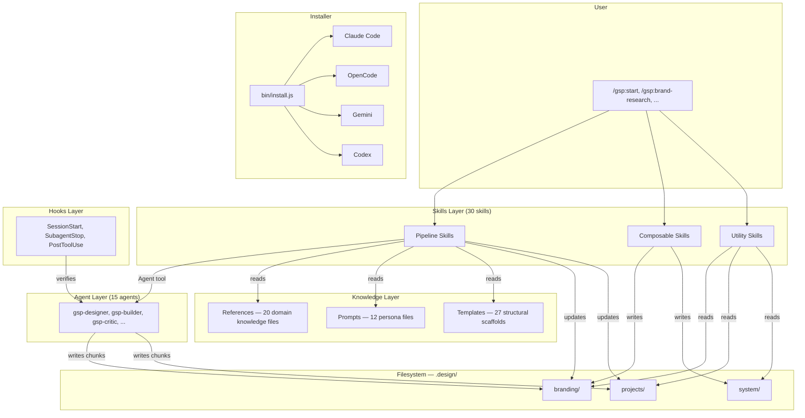
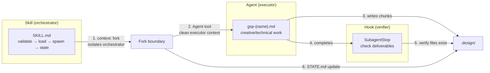
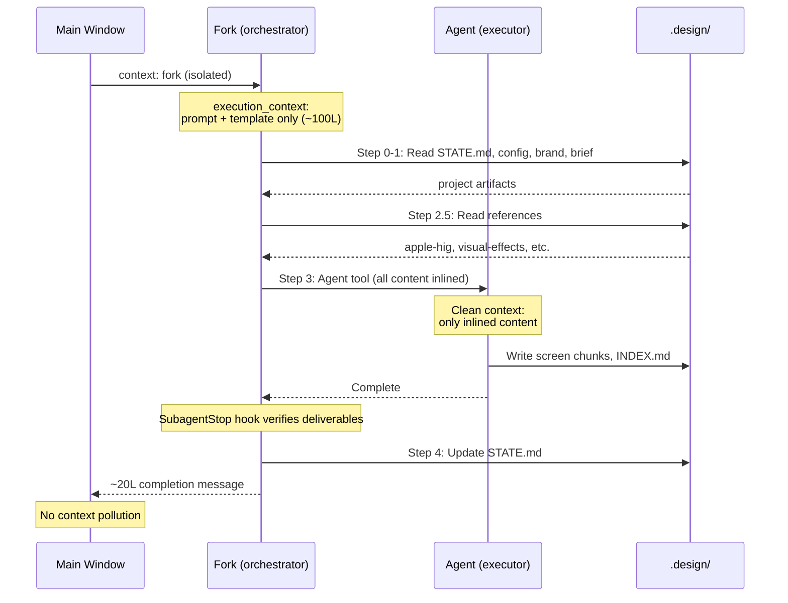
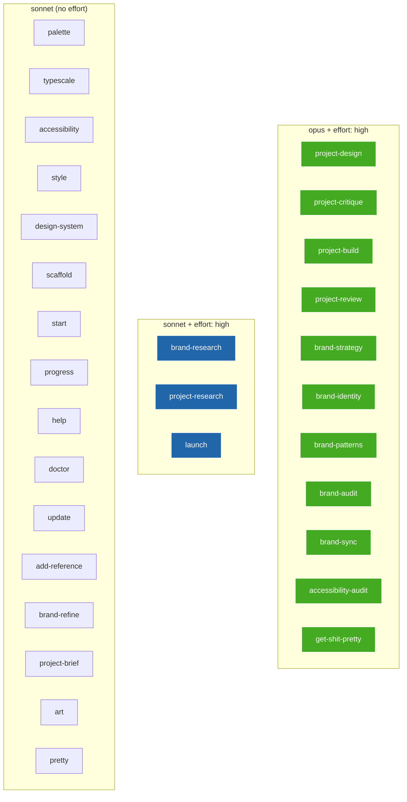
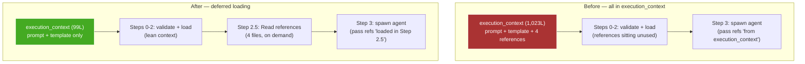
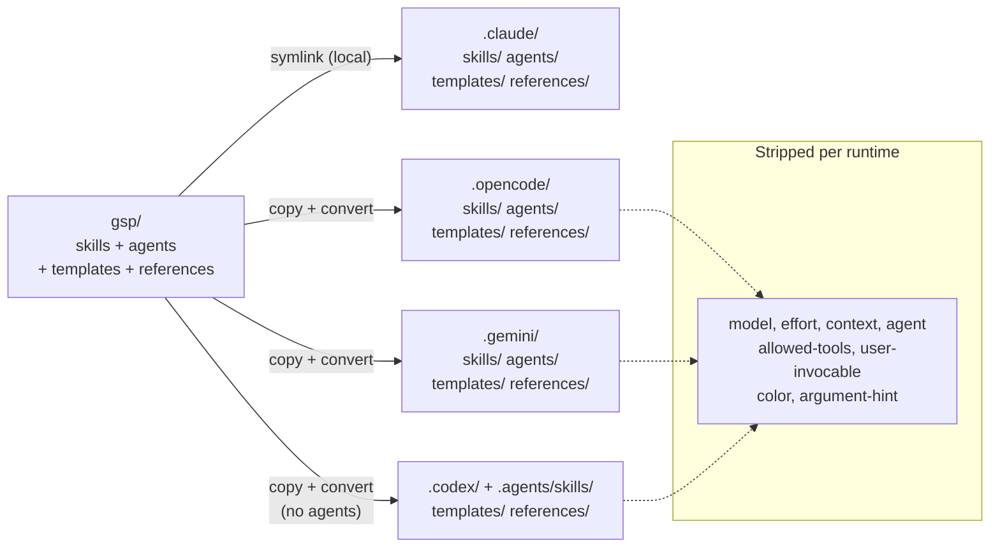

# GSP Architecture & Glossary

## System overview

## Dual-diamond pipeline

```mermaid
graph LR
    subgraph "Diamond 1 — Branding"
        BA["0. Audit<br/><sub>gsp-brand-audit</sub>"]
        BR["1. Research<br/><sub>gsp-brand-research</sub>"]
        BS["2. Strategy<br/><sub>gsp-brand-strategy</sub>"]
        BI["3. Identity<br/><sub>gsp-brand-identity</sub>"]
        BP["4. Patterns<br/><sub>gsp-brand-patterns</sub>"]
        BA -.->|optional| BR
        BR --> BS --> BI --> BP
    end

    subgraph "Diamond 2 — Project"
        PBR["1. Brief<br/><sub>gsp-project-brief</sub>"]
        PRE["2. Research<br/><sub>gsp-project-research</sub>"]
        PDE["3. Design<br/><sub>gsp-project-design</sub>"]
        PCR["4. Critique<br/><sub>gsp-project-critique</sub>"]
        PBU["5. Build<br/><sub>gsp-project-build</sub>"]
        PRV["6. Review<br/><sub>gsp-project-review</sub>"]
        PBR --> PRE --> PDE --> PCR --> PBU --> PRV
        PCR -.->|"needs-revision"| PDE
        PRV -.->|"needs-revision"| PBU
    end

    BP -->|"brand.ref"| PBR
    PRV -.->|optional| LA["Launch<br/><sub>gsp-launch</sub>"]
```

## Skill → Agent → Hook wiring

### Wiring table

| Skill | Agent(s) | SubagentStop hook | Forked |
|-------|----------|-------------------|--------|
| `project-design` | `gsp-designer` | screen chunks + INDEX.md + preview.html | yes |
| `project-critique` | `gsp-critic` + `gsp-accessibility-auditor` | critique.md + prioritized-fixes.md + strengths.md | yes |
| `project-build` | `gsp-builder` (N times) | BUILD-LOG.md + INDEX.md + no TODOs | no |
| `project-review` | `gsp-reviewer` | acceptance-report.md + issues.md + INDEX.md + verdict | yes |
| `launch` | `gsp-campaign-director` | -- | yes |
| `brand-research` | `gsp-researcher` | -- | no |
| `brand-strategy` | `gsp-brand-strategist` | -- | no |
| `brand-identity` | `gsp-creative-director` | -- | no |
| `brand-guidelines` | `gsp-brand-engineer` | -- | no |
| `brand-audit` | `gsp-brand-auditor` | -- | no |
| `brand-sync` | `gsp-brand-syncer` | -- | no |
| `project-brief` | `gsp-scoper` | -- | no |
| `project-research` | `gsp-project-researcher` | -- | no |
| `accessibility-audit` | `gsp-accessibility-auditor` | -- | no |
| `art` / `pretty` | `gsp-ascii-artist` | -- | no |

## Context flow in a forked skill

## Model routing

## Execution context optimization

### Context savings per skill

| Skill | Before | After | Saved |
|-------|--------|-------|-------|
| `project-design` | 6 includes (1,023L) | 2 includes (99L) | **-924L** |
| `project-critique` | 8 includes (871L) | 3 includes (105L) | **-766L** |
| `project-build` | 5 includes (909L) | 2 includes (126L) | **-783L** |
| `gsp-start` | 10 includes (561L) | 1 include (87L) | **-474L** |
| **Total** | **3,364L** | **417L** | **-2,947L** |

## `.design/` filesystem structure

```mermaid
graph TD
    D[".design/"]
    D --> BR["branding/{brand}/"]
    D --> PJ["projects/{project}/"]
    D --> SY["system/"]
    D --> CL["CHANGELOG.md"]

    BR --> BA["audit/"]
    BR --> BD["discover/"]
    BR --> BST["strategy/"]
    BR --> BID["identity/"]
    BR --> BPA["patterns/<br/>tokens.json + INDEX.md"]
    BR --> BBR["BRIEF.md"]
    BR --> BSS["STATE.md"]
    BR --> BCF["config.json"]

    PJ --> PBR["brief/"]
    PJ --> PRE["research/"]
    PJ --> PDE["design/<br/>screen-NN-name.md + shared/ + preview.html"]
    PJ --> PCR["critique/"]
    PJ --> PBU["build/<br/>BUILD-LOG.md + SCAFFOLD-LOG.md"]
    PJ --> PRV["review/"]
    PJ --> PCB["codebase/<br/>MANIFEST.md"]
    PJ --> PEX["exports/<br/>INDEX.md"]
    PJ --> PRF["references/"]
    PJ --> PBF["brand.ref"]

    SY --> SST["STACK.md"]
    SY --> SCO["COMPONENTS.md"]
    SY --> STO["TOKENS.md"]
    SY --> SCN["CONVENTIONS.md"]
```

## Multi-runtime installer

## Glossary

### Components

**Skill** — A markdown file (`gsp/skills/{name}/SKILL.md`) that defines a user-invocable command (`/gsp:{name}`). Contains YAML frontmatter + `<context>`, `<objective>`, `<execution_context>`, and `<process>` sections. Skills are orchestrators: they validate prerequisites, load context from disk, spawn agents, and update state. The single source of truth for all runtimes.

**Agent** — A markdown file (`gsp/agents/gsp-{name}.md`) defining a specialized executor. Spawned by skills via the Agent tool into a fresh context. Agents receive all content inlined in their prompt — they don't re-read input files (exceptions: builder reads live codebase, reviewer uses Grep/Glob on source). Each agent is owned by one or more skills.

**Prompt** — (Deprecated) Agent methodology now lives directly in agent definitions (`gsp/agents/gsp-*.md`). The `gsp/prompts/` directory is reserved but empty.

**Reference** — Domain knowledge (`gsp/references/{name}.md`, 55-760 lines) that agents need for their work. Examples: Nielsen's 10 heuristics, WCAG 2.2 checklist, Apple HIG patterns, typography scale definitions, visual effects vocabulary. Loaded at spawn time via explicit Read calls, NOT in execution_context.

**Template** — Structural scaffolding (`gsp/templates/`) for files that skills write to `.design/`. Two categories: (1) phase output templates (`phases/*.md`) define the shape of each phase's deliverables, (2) project/brand scaffolds (`projects/`, `branding/`) define initial BRIEF.md, STATE.md, config.json, ROADMAP.md. Read at the moment of writing, not loaded upfront.

**Hook** — A lifecycle callback defined in `gsp/hooks/hooks.json`. Runs automatically at specific events: `SessionStart` (context recovery after compaction), `SubagentStop` (verify agent wrote its expected deliverables), `PostToolUse` (lint files after Edit/Write). Hooks are prompt-type (inject verification instructions) or command-type (run a shell script).

**Script** — Shell or JS utilities in `scripts/` invoked by hooks or the installer. `gsp-context-recovery.sh` rebuilds `.design/` context after compaction. `lint-check.sh` runs after gsp-builder writes files. `gsp-statusline.js` + `statusline-dispatcher.js` power the terminal status display.

**Chunk** — A self-contained markdown file in `.design/` representing one atomic deliverable. Follows the format spec in `references/chunk-format.md`. Has a header line with phase, project, and generation date. Chunks are the integration unit: each phase reads prior chunks from disk and writes new ones. Indexed via `INDEX.md` files per phase.

**Diamond** — A pipeline of sequential phases. GSP uses two diamonds: Branding (audit → research → strategy → identity → patterns) and Project (brief → research → design → critique → build → review). Phases connect via the filesystem — each phase writes chunks that the next phase reads.

**Execution context** — The `<execution_context>` block in a SKILL.md that declares `@` file includes. These files are injected into the skill's context at load time. Per optimization rules: only include content the orchestrator itself needs (prompts, templates). References go in a "Load references" step instead.

**Fork** — A skill running with `context: fork` in frontmatter executes in an isolated subagent. No conversation history from the main window bleeds in. The fork's execution_context, file reads, and agent spawns all happen in isolation. Only the fork's final output (~20 lines) returns to the main window. Write calls inside a fork persist to the same filesystem.

### Artifact files

**STATE.md** — Phase completion tracker for a brand or project. Records which phases are complete, in-progress, needs-revision, or pending. Updated by skills at the end of each phase. The primary mechanism for pipeline continuity — `gsp-start` reads it to resume where you left off.

**config.json** — Brand or project configuration. Contains `project_type` ("brand" or "design"), `implementation_target`, `design_scope`, `codebase_type`, `git.branch`, and system config. Written by `gsp-start`, read by every pipeline skill.

**BRIEF.md** — Project or brand brief gathered by `gsp-start` through interactive questioning. Contains audience, goals, personas, constraints, personality direction. The primary input for all downstream phases.

**brand.ref** — A small file in each project directory that points to which brand the project uses. Contains brand name, relative path, consumed_at date, and identity_hash. This is how the project diamond knows which branding diamond to read.

**tokens.json** — W3C design tokens in the brand's `patterns/` directory. The source of truth for colors, typography, spacing, elevation, radius. Consumed by `gsp-builder` to integrate into the codebase (CSS variables, Tailwind config, or theme file).

**INDEX.md** — Phase-level chunk index. Each phase directory has one. Contains a markdown table listing all chunks with file paths and approximate line counts. Used by downstream phases to discover what a prior phase produced.

**exports/INDEX.md** — Cross-phase exports index with `<!-- BEGIN:{phase} -->` / `<!-- END:{phase} -->` markers. Each phase appends its key deliverables here. Provides a single entry point to all project artifacts.

**BUILD-LOG.md** — Written by `gsp-builder` during the build phase. Records what files were created/modified per build sub-phase (foundations, each screen). Used by the review phase to know what to verify.

**MANIFEST.md** — Written at the end of build. Maps components, patterns, and files produced. Cross-references with `.design/system/COMPONENTS.md` to track what was added vs modified.

### Skill categories

**Pipeline skill** — Spawns agents, produces chunks, updates STATE.md. Has `model:` + `effort:` in frontmatter. Examples: `project-design`, `brand-strategy`, `project-build`.

**Composable skill** — Runs inline (no agent), deterministic, writes to a predictable path. Used standalone or as a building block consumed by pipeline phases. Examples: `palette` (OKLCH colors), `typescale` (type scale), `style` (tokens from presets), `scaffold` (stack setup).

**Utility skill** — Entry points, diagnostics, navigation. Needs conversation context — never forked. Examples: `start` (entry point), `progress` (status display), `doctor` (health check), `help` (command reference).

### Frontmatter fields

**Skill frontmatter:**

| Field | Values | Purpose |
|-------|--------|---------|
| `name` | kebab-case | Skill identifier, becomes `/gsp:{name}` |
| `description` | string, max 200 chars | What the skill does — Claude uses this to decide when to auto-invoke |
| `user-invocable` | `true` / `false` | Whether the skill appears in `/` menu. `false` for meta skills. |
| `model` | `opus` / `sonnet` / `haiku` | Model override. Pipeline creative = opus, research/utility = sonnet. |
| `effort` | `low` / `medium` / `high` / `max` | Effort level. Pipeline phases use `high`. `max` is Opus-only. |
| `context` | `fork` | Run in isolated subagent. Only for skills with zero AskUserQuestion calls. |
| `allowed-tools` | list of tool names | Tools available during skill execution. |

**Agent frontmatter:**

| Field | Values | Purpose |
|-------|--------|---------|
| `name` | `gsp-{name}` | Agent identifier referenced in skill spawn instructions |
| `description` | string | What the agent does + which skill(s) spawn it |
| `tools` | list of tool names | Tools the agent can use |
| `color` | color name | Terminal UI color for agent output |
| `hooks` | hook config object | Agent-scoped lifecycle hooks (e.g., PostToolUse lint) |
| `memory` | boolean | Whether the agent retains memory across invocations |
| `model` | model name | Model override for agent execution |
